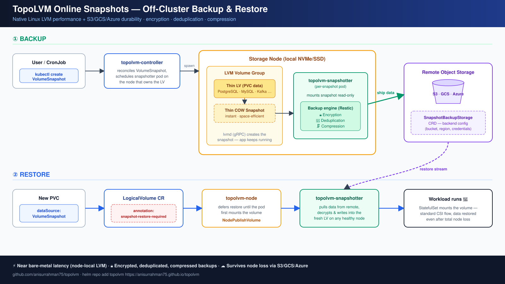

# TopoLVM with Off-Cluster Snapshot Backup & Restore — Quick Start

**Native Linux LVM performance for Kubernetes databases, now with S3/GCS/Azure
snapshot backups.**

This is a fork build of [TopoLVM](https://github.com/topolvm/topolvm) that adds
**online VolumeSnapshot backup & restore**: LVM thin COW snapshots are shipped to
remote object storage with **encryption, deduplication, and compression**
(Restic-based engine), and restored through the standard CSI flow — data streams
back from remote storage at first mount, onto **any healthy node**.



## Why this matters

TopoLVM carves volumes straight from node-local disks — near bare-metal I/O
latency, which is why it's a favorite for PostgreSQL, MySQL, Kafka, ClickHouse,
and Elasticsearch. But node-local also meant: **if the node dies, the volume and
all its snapshots die with it.** This build closes that gap:

- 📸 `VolumeSnapshot` → instant LVM thin COW snapshot (workload keeps running)
- 🚚 A snapshotter pod on the LV's node ships the data to **S3 / GCS / Azure**
- 🔒 Encrypted, deduplicated, compressed at rest
- ♻️ Restore = create a PVC from the snapshot; data streams back at first mount
- ⚙️ Backend configured with a Kubernetes-native `SnapshotBackupStorage` CRD

## Published artifacts — all public, no login required

| Artifact | Reference |
| --- | --- |
| Image | `ghcr.io/anisurrahman75/topolvm:0.41.1-rc.0` |
| Image (with CSI sidecars) | `ghcr.io/anisurrahman75/topolvm-with-sidecar:0.41.1-rc.0` |
| Helm chart | `https://anisurrahman75.github.io/topolvm` — version `16.2.0` |
| Helm chart (OCI) | `oci://ghcr.io/anisurrahman75/charts/topolvm` — version `16.2.0` |

## Prerequisites

- Kubernetes v1.33–1.35, `kubectl`, `helm` (v3.8+).
- **cert-manager** (the admission webhook needs TLS).
- **An LVM volume group on each storage node.** The default device-class `ssd`
  expects volume group **`myvg1`** — change
  `lvmd.deviceClasses[].volume-group` to match your nodes.

## Install

```bash
# 1. cert-manager
helm repo add jetstack https://charts.jetstack.io && helm repo update
helm install cert-manager jetstack/cert-manager \
  -n cert-manager --create-namespace --set crds.enabled=true

# 2. TopoLVM
helm repo add topolvm https://anisurrahman75.github.io/topolvm
helm repo update
helm install topolvm topolvm/topolvm --version 16.2.0 \
  -n topolvm-system --create-namespace
```

Or install the chart via OCI, no repo alias needed:

```bash
helm install topolvm oci://ghcr.io/anisurrahman75/charts/topolvm --version 16.2.0 \
  -n topolvm-system --create-namespace
```

> If the `topolvm` alias on your machine already points at the official repo,
> add this one under a different alias — the official index has no 16.2.0.

Custom volume group:

```bash
  --set lvmd.deviceClasses[0].name=ssd \
  --set lvmd.deviceClasses[0].volume-group=YOUR_VG \
  --set lvmd.deviceClasses[0].default=true \
  --set lvmd.deviceClasses[0].spare-gb=10
```

## Verify

```bash
kubectl -n topolvm-system get pods            # controller / node / lvmd Running
kubectl get storageclass topolvm-provisioner  # provisioner: topolvm.io
```

Provision a volume (the StorageClass uses `WaitForFirstConsumer`, so the PVC
binds once a pod mounts it):

```bash
kubectl apply -f - <<'EOF'
apiVersion: v1
kind: PersistentVolumeClaim
metadata: { name: topolvm-test }
spec:
  accessModes: ["ReadWriteOnce"]
  resources: { requests: { storage: 1Gi } }
  storageClassName: topolvm-provisioner
---
apiVersion: v1
kind: Pod
metadata: { name: topolvm-test-pod }
spec:
  containers:
  - name: app
    image: busybox:1.36
    command: ["sh","-c","sleep 3600"]
    volumeMounts: [{ name: v, mountPath: /data }]
  volumes:
  - name: v
    persistentVolumeClaim: { claimName: topolvm-test }
EOF

kubectl get pvc topolvm-test -w   # -> Bound
```

Every step above was verified end-to-end on a kind cluster (k8s v1.34) with a
clean helm configuration and **zero registry authentication**.

> **Testing on kind?** LVM in a container has no udev — set
> `activation { udev_sync = 0  udev_rules = 0 }` and
> `devices { obtain_device_list_from_udev = 0 }` in the node's
> `/etc/lvm/lvm.conf`, or volume creation fails with `device not cleared`.
> Real hosts don't need this.

## Uninstall

```bash
helm uninstall topolvm -n topolvm-system
kubectl delete namespace topolvm-system
```

> The chart templates its CRDs, so `helm uninstall` deletes them too. If you
> reinstall immediately, wait for the `logicalvolumes.topolvm.io` CRD to finish
> terminating first (`kubectl get crd | grep topolvm`), or the fresh install can
> race with the deletion.

## Learn more

- Design doc: [`design/restic-snapshot/DESIGN.md`](./design/restic-snapshot/DESIGN.md)
- Full install guide: [`INSTALL.md`](./INSTALL.md)
- Upstream project: [topolvm/topolvm](https://github.com/topolvm/topolvm)
